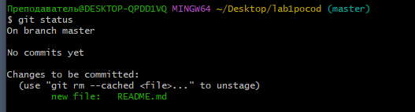
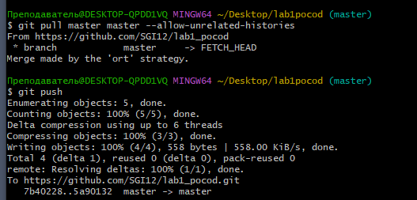

# Отчет по лабораторной №1

## Группа: ИКПИ-06

## Студенты: Зарецкий, Облаков, Смирнова

Используемые коммманды: 

git clone  
git init  
git push  
git pull  
git add  
git index  
git ignore  

## Скриншоты рабочего окна:

  

  
